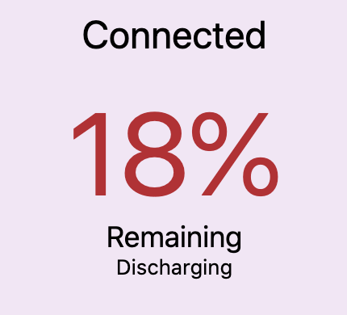
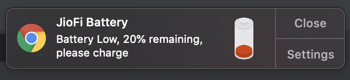

JioFi Stats Notifier
====================

This is a Chrome extension which keeps you updated about your JioFi

Currently it supports only JioFi model JMR1040

Supported features:
------------------
1. Battery stats in extensions tray
   - It shows available battery with different colors (gree, blue, red)
   - If it's charging or not
   - Future developement: Show if the battery is fully charged

  

2. Notification on low battery
   - A popup notification at 20, 15, 10 and 5 percent battery

  

